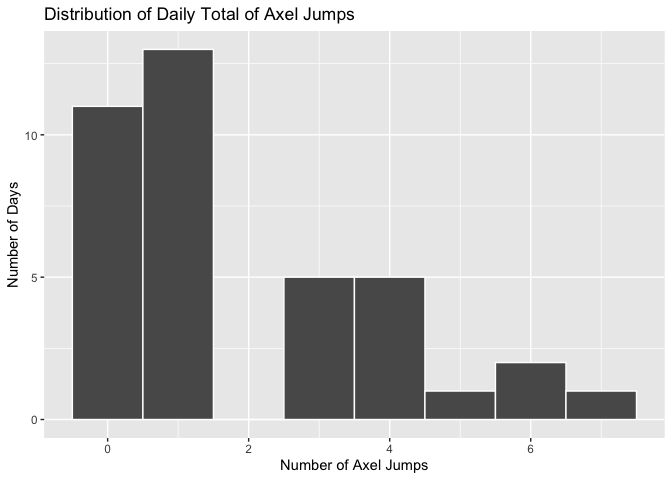
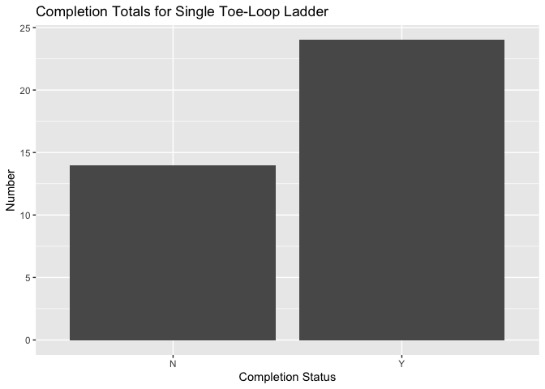
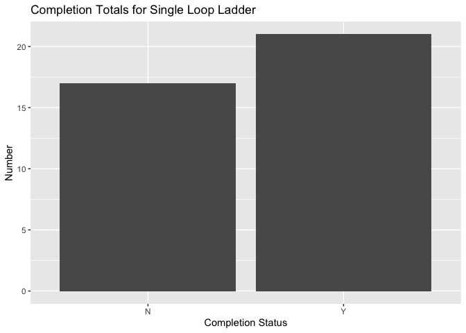

PS07
================

``` r
library(tidyverse)
library(ggplot2)
skating_data <- read.csv("https://docs.google.com/spreadsheets/d/e/2PACX-1vRHL3GBQobQsveBg1-hqydHUPAxx4ni3XmFJmxn1vlvX8B7JGYtnx3OX-uBYVxKI3_khP8LuoFL-wD2/pub?gid=0&single=true&output=csv")
```

# Figure Skating

I am a figure skater and over the last several months I have been
collecting data about my practice sessions. After each day of practice,
I record:

-   The date

-   How many of each type of jump I did (numeric)

    -   `X1A`: single axel

    -   `X2S`: double salchow

    -   `X2Lo`: double loop

    -   `X2T`: double toe-loop

    -   `X2Fl`: double flip

    -   `X2fl.2T`: double flip + double toe-loop combination

    -   `X2t.2T`: double toe-loop + double toe-loop combination

    -   `X2Lz`: double lutz

    -   `X2A`: double axel

-   Whether or not I completed my skill dills (Y/N binary)

    -   `X1T.ladder`: single toe-loop jump ladder

    -   `X1L.ladder`: single loop jump ladder

-   Whether or not I practiced spins (Y/N binary)

    -   `Spins`

-   How many runthroughs of each of my programs I completed (numeric)

    -   `SP.RT`: short program

    -   `FP.RT`: freeskate

    -   `FD.RT`: solor freedance

-   How many international pattern ice dances I practiced (numeric)

    -   `Dances`

-   How many sessions I skated

    -   `Hours`

-   A short refelction of my practice that day

## Axel Jumps

The jump that I practice most frequently is the single axel jump. A
single axel jump takes off on a forward outside edge (leaning towards
the outside of the foot to follow a circle a curve), rotates 1.5 times
in the air, and lands on a backwards outside edge on the other foot.

Here is a graph of the distribution of how many axels I complete on a
single day of practice.

<!-- -->

## Skill Drills

### Single Toe-Loop Ladder

The single toe-loop ladder is a skill drill where the skater will
complete all single jumps with a single toe-loop combo on each one. A
single toe loop jump is a jump that takes off and lands on the backwards
outside edge of the same foot. Takeoff is aided using the toe pick of
the free leg.

Here is a graph of how many days I completed the single toe-loop ladder
during my practice time since I started collecting data.

<!-- -->

### Single Loop Ladder

The single loop ladder is similar to the single toe-loop ladder, but
instead the combo is completed with a single loop jump for each single
jump pass. A single loop jump is a jump that takes off and lands on the
backwards outside edge of the same foot. Takeoff is achieved without
help from the toepick of the free leg.

Here is a graph of how many days I completed the single loop ladder
during my practice time since I started collecting data.

<!-- -->
